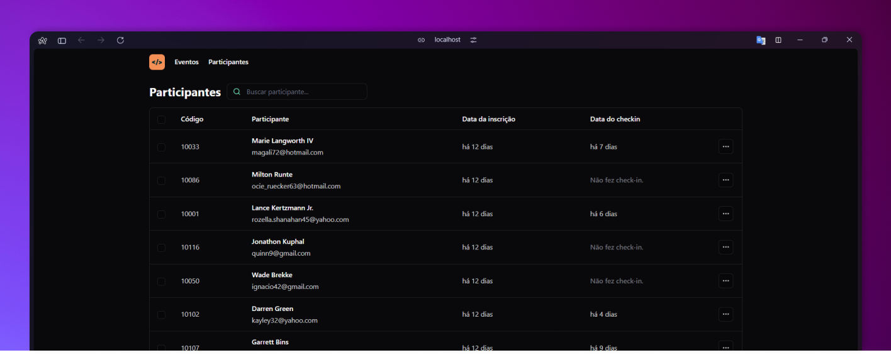

# NLW Unite (React) 

Essa aplicação foi desenvolvida durante o NLW Unite da Rocketseat utilizando React, TypeScript, Shadcn UI.

## Executando

Após clonar o repositório, acesse a pasta do projeto e execute os comandos abaixo:

```sh
npm install
npm run dev
```

Acesse http://localhost:5173 para visualizar a aplicação.

## API do projeto

Aqui você tem acesso ao [repositório](https://github.com/ecthon/nlw-unite-node) do projeto back-end e outras informações para rodar a API.